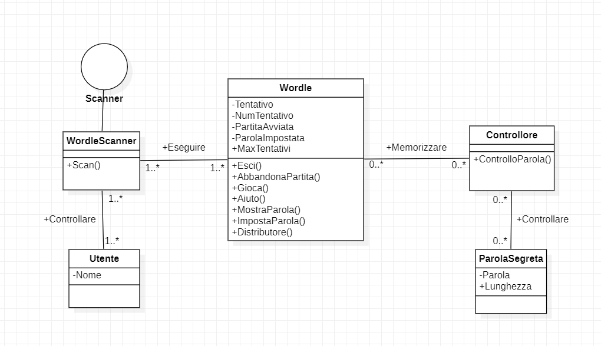
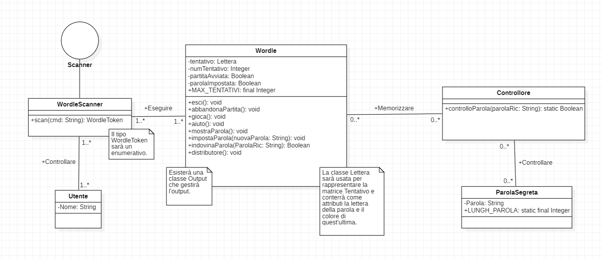

# Report

**INDICE**

1. Introduzione

2. Modello di dominio

3. Requisiti specifici

   3.1 Requisiti funzionali

   3.2 Requisiti non funzionali

4. System Design

5. OO Design

6. Riepilogo del test

7. Manuale utente

8. Processo di sviluppo e organizzazione del lavoro

9. Analisi retrospettiva
   
   9.1 Sprint 1

   9.2 Sprint 2

---
_Introduzione_
-
Questo progetto ha come obiettivo quello di realizzare il gioco chiamato Wordle. 

E' prevista la presenza di due utenti: il paroliere e il giocatore. 
Il primo dovrà definire la parola segreta formata da cinque lettere su cui si baserà il gioco. 
Il secondo avrà a disposizione sei tentativi per poter indovinare la parola segreta.

Ad ogni tentativo le celle delle lettere della parola saranno colorate di grigio nel caso in cui la specifica lettera non appartiene alla parola; di giallo nel caso in cui la lettera appartiena alla parola, ma in una posizione differente; di verde se la lettera appartiene alla parola e si trova nella posizione giusta.

_Modello di dominio_
-

_Requisiti specifici_
-
Requisiti funzionali:

**Sprint 1**

E' stata abbozzata la relazione tecnica:

	- Formato: Markdown
	- Dove: nel repository /docs/
	- Nome file: Report.md
	- Sezioni: 1. Introduzione 2. Modello di dominio 3. Requisiti specifici 3.1 Requisiti funzionali 3.2 Requisiti non funzionali 5. OO Design (diagrammi delle classi e diagrammi di sequenza delle user story più importanti con eventuali commenti alle decisioni prese).
   
Criteri che devono essere soddisfatti per qualsiasi user story
- C'è un issue con label «user story»
- La issue è in un Milestone e in una Project Board
- Assegnazione a uno o al più due componenti del team
- Ogni classe è preceduta da un commento che riassume la responsabilità della classe
- Ogni classe è preceduta da un commento per indicare se è di tipo Entity, Control, Boundary, noECB.
- i commenti iniziano con /** e terminano con with */
- I commit devono avere una descrizione breve ma significativa
- C'è una Pull Request (PR) che corrisponde alla user story
- La PR è in un Milestone ma non in una Project Board
- C'è un commento che linka la PR all'issue (es. "closes #22")
- La PR è accettata a review avvenuto ed esplicito
- Build costruito con successo
- Docker image caricata con successo
- L'esecuzione rispetta i criteri di accettazione

Requisiti non funzionali:

RNF1: il container docker dell’app deve essere eseguito da terminali che supportano Unicode con encoding UTF-8 o UTF-16.

Elenco di terminali supportati:
Linux:
- terminal
Mac OS
- terminal
Windows
- Powershell
- Git Bash (in questo caso il comando Docker ha come prefisso winpty; es: winpty docker -it ....)

Comando per l’esecuzione del container:

Dopo aver eseguito il comando docker pull copiandolo da GitHub Packages, Il comando Docker da usare per eseguire il container contenente l’applicazione è:

docker run --rm -it ghcr.io/softeng2122-inf-uniba/wordle-base2122:latest

dove base2122 sarà sostitituito con il nome del gruppo.

_OO Design_
-

RESPONSABILITA' CLASSI:
- Si è scelto di utilizzare la classe ParolaSegreta perchè sarà necessaria per creare istanze che rappresenteranno la parola segreta su cui si baserà il gioco. Essa sarà una classe Entity.
- Si è scelto di utilizzare la classe Controllore perchè sarà necessaria per controllare la forma corretta della parola segreta inserita (cinque lettere). Essa sarà una classe Control.
- Si è scelto di utilizzare la classe Utente perchè sarà necessaria per creare istanze che rappresenteranno l'utente che si interfaccerà al gioco. Essa sarà una classe Entity.
- Si è scelto di utilizzare la classe WordleScanner, che implementerà l'interfaccia Scanner, perchè sarà necessaria un'operazione di parsing sull'input immesso dall'utente. Essa sarà una classe Control.
- Si è scelto di utilizzare la classe Wordle perchè sarà necessaria per rappresentare il gioco con tutti i metodi richiesti per poter essere eseguito. Essa sarà una classe Boundary.

_Analisi retrospettiva_
- 
