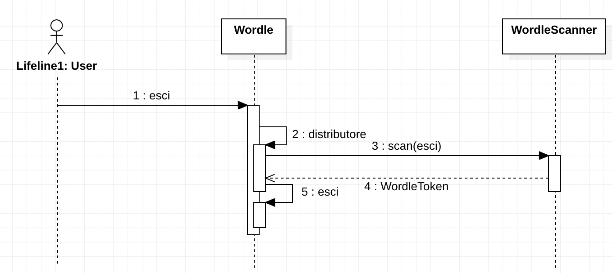
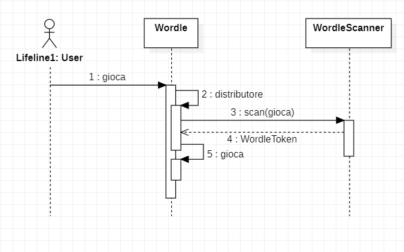
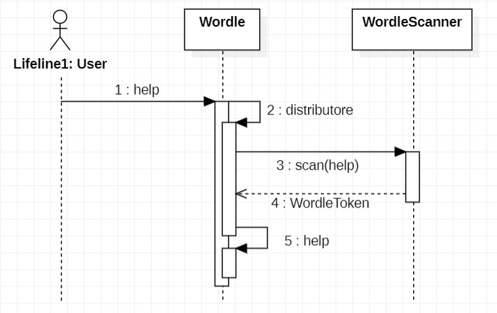
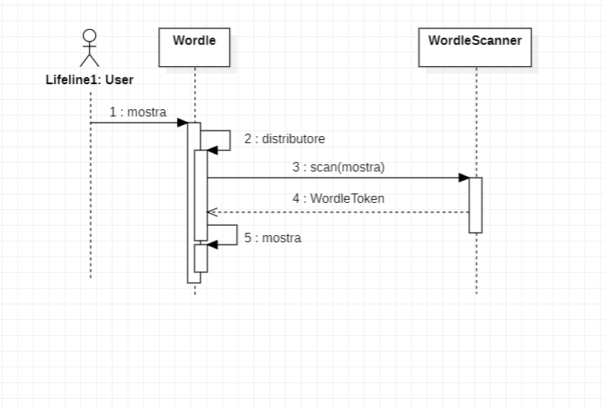
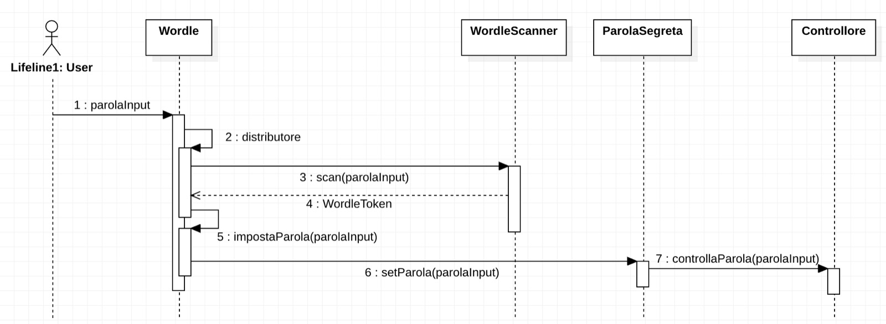
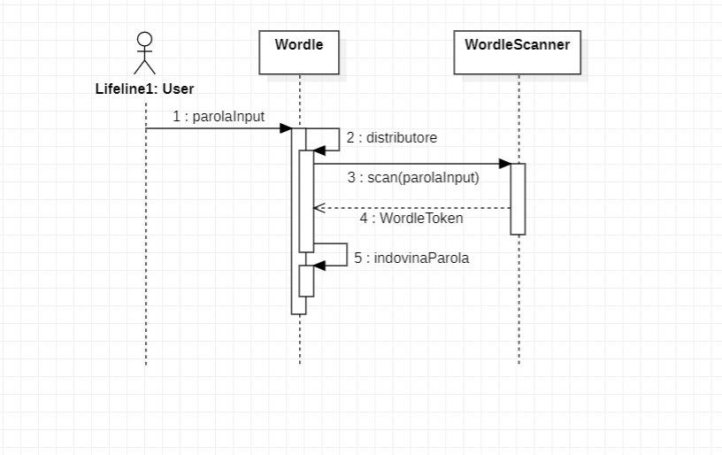
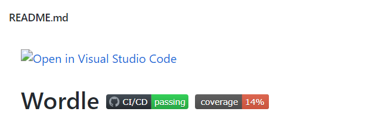
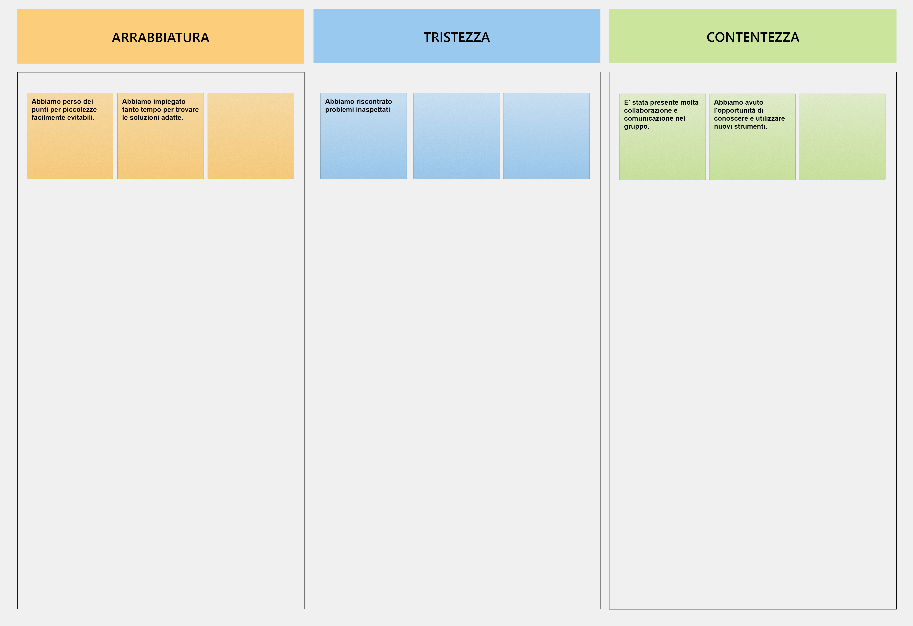

# Report

**INDICE**

1. Introduzione

2. Modello di dominio

3. Requisiti specifici

   3.1 Requisiti funzionali

   3.2 Requisiti non funzionali

4. System Design

5. OO Design

6. Riepilogo del test

7. Manuale utente

8. Processo di sviluppo e organizzazione del lavoro

9. Analisi retrospettiva
   
   9.1 Sprint 1

---
_Introduzione_
-
Questo progetto ha come obiettivo quello di realizzare il gioco chiamato Wordle. 

E' prevista la presenza di due utenti: il paroliere e il giocatore. 
Il primo dovrà definire la parola segreta formata da cinque lettere su cui si baserà il gioco. 
Il secondo avrà a disposizione sei tentativi per poter indovinare la parola segreta.

Ad ogni tentativo le celle delle lettere della parola saranno colorate di grigio nel caso in cui la specifica lettera non appartiene alla parola; di giallo nel caso in cui la lettera appartiena alla parola, ma in una posizione differente; di verde se la lettera appartiene alla parola e si trova nella posizione giusta.

_Modello di dominio_
-

_Requisiti specifici_
-
Requisiti funzionali:

**Sprint 1**

E' stata abbozzata la relazione tecnica:

	- Formato: Markdown
	- Dove: nel repository /docs/
	- Nome file: Report.md
	- Sezioni: 1. Introduzione 2. Modello di dominio 3. Requisiti specifici 3.1 Requisiti funzionali 3.2 Requisiti non funzionali 5. OO Design (diagrammi delle classi e diagrammi di sequenza delle user story più importanti con eventuali commenti alle decisioni prese).
   
Criteri che devono essere soddisfatti per qualsiasi user story
- C'è un issue con label «user story»
- La issue è in un Milestone e in una Project Board
- Assegnazione a uno o al più due componenti del team
- Ogni classe è preceduta da un commento che riassume la responsabilità della classe
- Ogni classe è preceduta da un commento per indicare se è di tipo Entity, Control, Boundary, noECB.
- i commenti iniziano con /** e terminano con with */
- I commit devono avere una descrizione breve ma significativa
- C'è una Pull Request (PR) che corrisponde alla user story
- La PR è in un Milestone ma non in una Project Board
- C'è un commento che linka la PR all'issue (es. "closes #22")
- La PR è accettata a review avvenuto ed esplicito
- Build costruito con successo
- Docker image caricata con successo
- L'esecuzione rispetta i criteri di accettazione

Requisiti non funzionali:

RNF1: il container docker dell’app deve essere eseguito da terminali che supportano Unicode con encoding UTF-8 o UTF-16.

Elenco di terminali supportati:
Linux:
- terminal
Mac OS
- terminal
Windows
- Powershell
- Git Bash (in questo caso il comando Docker ha come prefisso winpty; es: winpty docker -it ....)

Comando per l’esecuzione del container:

Dopo aver eseguito il comando docker pull copiandolo da GitHub Packages, Il comando Docker da usare per eseguire il container contenente l’applicazione è:

docker run --rm -it ghcr.io/softeng2122-inf-uniba/wordle-base2122:latest

dove base2122 sarà sostitituito con il nome del gruppo.

_OO Design_
-

RESPONSABILITA' CLASSI:
- Si è scelto di utilizzare la classe ParolaSegreta perchè sarà necessaria per creare istanze che rappresenteranno la parola segreta su cui si baserà il gioco. Essa sarà una classe Entity.
- Si è scelto di utilizzare la classe Controllore perchè sarà necessaria per controllare la forma corretta della parola segreta inserita (cinque lettere). Essa sarà una classe Control.
- Si è scelto di utilizzare la classe Utente perchè sarà necessaria per creare istanze che rappresenteranno l'utente che si interfaccerà al gioco. Essa sarà una classe Entity.
- Si è scelto di utilizzare la classe WordleScanner, che implementerà l'interfaccia Scanner, perchè sarà necessaria un'operazione di parsing sull'input immesso dall'utente. Essa sarà una classe Control.
- Si è scelto di utilizzare la classe Wordle perchè sarà necessaria per rappresentare il gioco con tutti i metodi richiesti per poter essere eseguito. Essa sarà una classe Boundary.

DIAGRAMMA DI SEQUENZA:
- /abbandona - Svolto da Aurora Toma

- /esci - Svolto da Francesco Papagno

- /gioca - Svolto da Giorgia Nardelli

- /help - Svolto da Alberttin Mihai Paduraru

- /mostra - Svolto da Giorgia Nardelli

- /nuova - Svolto da Francesco Papagno

- "parolaInput" - Svolto da Walter Mangione

DESCISIONI PRESE:
Errori spotbugs:
- H I Dm: Found reliance on default encoding in it.uniba.app.Wordle.abbandonaPartita(): new java.util.Scanner(InputStream)  At Wordle.java:[line 138]
- H I Dm: Found reliance on default encoding in it.uniba.app.Wordle.distributore(): new java.util.Scanner(InputStream)  At Wordle.java:[line 223]
- H I Dm: Found reliance on default encoding in it.uniba.app.Wordle.esci(): new java.util.Scanner(InputStream)  At Wordle.java:[line 103]

Nonostante la mancata chiusura dello scanner sia una cattiva pratica, se questo non dovesse accadere comporterebbe anche la chiusura del flusso System.in, causando la chiusura dello stream di input globale, rendendo impossibile la lettura su tale flusso per tutto il resto del processo. Perciò, si è preferito lasciare aperto lo stream per ulteriori letture.

- M B Dm: it.uniba.app.Wordle.esci() invokes System.exit(...), which shuts down the entire virtual machine  At Wordle.java:[line 112]
Invoking System.exit shuts down the entire Java virtual machine. This should only been done when it is appropriate. Such calls make it hard or impossible for your code to be invoked by other code. Consider throwing a RuntimeException instead.

Si è preferito chiudere anzitempo il programma, lasciando che sia la virtual machine a deallocare eventuali risorse per un motivo semplice:                                            
la soluzione proposta da SpotBugs nella documentazione relativa all'errore propone di sollevare un'eccezione di tipo RuntimeException, ma questo implica di dover restituire un valore mediante un'eccezione, sicuramente una cattiva pratica.      
Pensandoci, effettivamente, la chiusura del programma, in questo caso, non è causata da alcuna eccezione.
La seconda soluzione comporterebbe significativi cambi di progettazione.

_Riepilogo del test_
- 

_Manuale utente_
- 
Lista dei comandi disponibili:

_Giocatore_
- /gioca --> avvia una nuova partita;
- /abbandona --> abbandona una partita in corso;
- /esci --> esce dal gioco;
- /help --> mostra la lista dei comandi;

_Paroliere_
- /mostra --> visualizza la parola segreta;
- /nuova [parola] --> imposta una nuova parola segreta.

_Processo di sviluppo e organizzazione del lavoro_
-

Il nostro gruppo ha proceduto in tale modo:
- Quando possibile per tutti i partecipanti, abbiamo svolto un meeting di pianificazione lo stesso giorno in cui ci è estato assegnato il lavoro. Uno, o massimo due giorni dopo, altrimenti.
- Abbiamo deciso insieme gli assegnatari dei vari compiti tenendo in considerazione la difficoltà prevista per ognuno di essi, e le competenze di ciascuno di noi.
- Abbiamo svolto un meeting ogni due/tre giorni, per comunicare al gruppo eventuali problemi riscontrati nello svolgimento del compito, successivamente risolti con l'aiuto di ognuno di noi. Oppure per mostrare il lavoro svolto, chiedendo conferma o possibili miglioramenti al resto del gruppo.
- Siamo stati sempre in contatto telefonico, scegliendo in caso di necessità di svolgere più (o meno) meeting settimanali.
- In presenza di problemi tutti ci siamo attivati alla ricerca di una soluzione. Solo in casi estremi abbiamo preferito rivolgerci al professore.
- Solo dopo che tutti i partecipanti erano d'accordo su quanto eseguito, si è proceduto con l'approvazione della pull request. Quest'ultima spesso svolta in contemporanea con il meeting settimanale, al susseguirsi di una discussione a riguardo.

_Analisi retrospettiva_
- 
Sprint 1:
